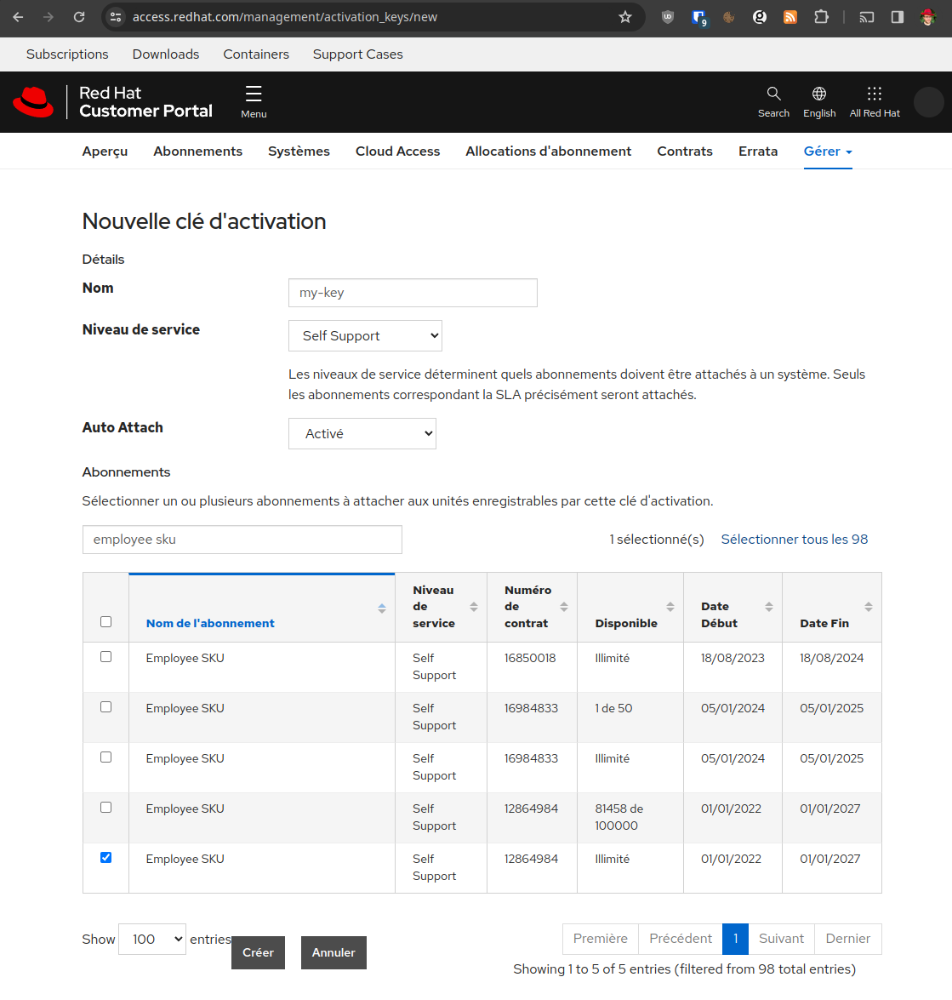

# ARM64 virtual machine

## Pre-requisites

On your workstation:

- Terraform
- Bash
- AWS CLI

Create an [activation key](https://access.redhat.com/management/activation_keys).



## VM Deployment

```sh
./prepare-cloud-init.sh
aws configure
terraform init
terraform apply
```

## Post-install configuration

```sh

```